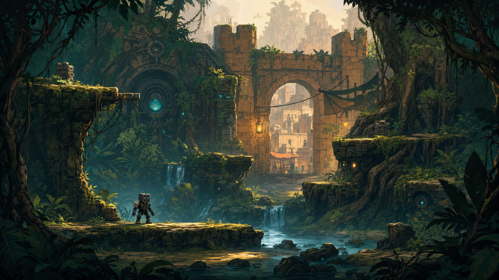

# WAYFARER ZERO

## Narrative, Game Design & Technical Bible — v0.2

**Implementation edition:** Prepared for Claude Code  
**Foundation stack:** Phaser 4.1, TypeScript, Vite, Arcade Physics  
**Foundation rule:** Build every system with procedural placeholder graphics; image production is paused and must not block engineering.

**Genre:** 2D side-scrolling action-adventure  
**Structure:** Semi-linear, ability-gated journey with a revisitable home hub  
**Tone:** Hopeful melancholy, dry humor, strange warmth  
**Player fantasy:** Begin as a discarded machine with only hands and nerve; cross a continent, rebuild a legendary body piece by piece, and decide what that power is for.

> **Creative promise:** Every recovered part changes three things: the hero’s silhouette, the player’s verbs, and the meaning of the story.

---

## 1. The one-page pitch

Rook, a compact utility automaton, wakes beneath a jungle scrapyard with almost everything removed: armor, tools, voice unit, memories, and nameplate. He can run, jump, grab, climb a ledge, and fight with his bare metal fists. A mark inside his empty chest points east along the abandoned Meridian Road.

The road crosses a trading town, flooded lowlands, the Sahara-like Glass Sea, red mountains, high grasslands, a vertical metropolis, an ash waste, and finally a living volcanic machine called the Heart Furnace. Rook’s missing equipment has become heirloom, merchandise, protection, and contraband in the communities along the route. Recovering it is never just looting a chest: a part may be earned, bought back, stolen from an oppressor, repaired for a friend, or willingly returned.

The city’s ruler, Surveyor Vey, is drawing water and cooling power from every outer region to keep the metropolis alive. Rook’s complete body is the only surviving master key to the climate network. The apparent quest—reassemble the legendary machine—gradually becomes a harder question: should Rook become the tool he was built to be?

At the Heart Furnace, the full suit lets Rook survive long enough to reconnect the world. The final act burns the armor away layer by layer. Rook returns home in the same small chassis seen at the start, but no longer stripped of identity.

**Working tagline:** *Every piece remembers.*

---

## 2. Non-negotiable design pillars

### 2.1 Visible becoming

Progress is readable without opening a menu. New equipment permanently affects Rook’s silhouette. The final form feels earned because the player remembers being small, exposed, and unable to cross the same kinds of obstacles.

### 2.2 Hands before weapons

Grabbing is the game’s connective verb. The same input catches a ledge, drags a crate, wrestles an enemy, carries a puzzle object, grabs a mount’s reins, and rescues a character. Fists remain useful after sword and gun are found.

### 2.3 The road is the story

Biomes are not disconnected levels. Water shortages, trade, migration, and the broken Meridian machinery connect them. Returning characters and changing routes make the continent feel continuous.

### 2.4 Knowledge is progression

Dialogue gives usable knowledge: a route, a custom, a machine behavior, a person’s motive, or part of a puzzle solution. The player listens because information changes what can be done, not just because it fills lore pages.

### 2.5 Home is the emotional reward

Wayhouse Nine grows from an empty room into a lived-in refuge. Resting is not a menu transition; it is a chance to repair, display discoveries, hear new dialogue, and see the consequences of helping people.

---

## 3. Audience, camera, and structure

- **Audience:** Teen and adult players who enjoy expressive platforming, readable combat, environmental storytelling, and light Metroidvania structure.
- **Camera:** Side-on. Mostly orthographic with controlled parallax and rare cinematic push-ins.
- **World structure:** Eight large regions joined by authored road sections. Each region contains a critical path, a settlement or social pocket, optional loops, one major puzzle chain, and a return shortcut.
- **Expected length:** 12–16 hours for the main story; 18–22 hours with optional contracts, home upgrades, and memory fragments.
- **Difficulty target:** Demanding but generous. Tight controls, clear anticipation, short boss runbacks, and extensive assists.
- **Save model:** Automatic at Waybells, home, major discoveries, and scene transitions.

This is not an open-world game. The sense of distance comes from contrast, recurring travelers, changing skies, and the road’s consequences—not from empty scale.

---

## 4. World premise

Long before the current settlements, the **Meridian** moved water, heat, and freight between biomes. Its machines were practical rather than mystical, but generations of partial knowledge have turned maintenance rituals into local traditions.

The network’s thermal regulator, the **Heart Furnace**, is failing. Surveyor Vey keeps the great city of Aurelia cool by closing outer valves. Jungles flood, wells vanish, mountain thaw becomes violent, and lava moves under the Ash March. Vey believes one dense city is more survivable than a scattered world.

Rook was once **Wayfarer Unit 0**, a routekeeper carrying the network’s root permissions. Years earlier, Rook discovered Vey’s plan and voluntarily scattered the authorization hardware by ordering a salvage caravan to dismantle him. The memory of that choice was lost with the parts.

The player therefore reassembles both the solution and the original danger.

---

## 5. Story structure and landscapes

| Chapter | Region | Story purpose | Signature play | Major recovery |
|---|---|---|---|---|
| Prologue | **Verdant Wreck** — rain jungle and buried machine ruins | Rook wakes, learns the physical language, follows the first road mark | Fists, grab, carry, jump, ledges | Canopy Salvage |
| I | **Mossgate** — trade town and river terraces | Establish home, store, companions, and the human cost of old salvage | NPC clues, errands with consequences, object puzzles | Porter Harness |
| II | **The Drowned Works** — mangrove, aqueduct, flooded factory | Show that the Meridian still reacts; introduce systemic route puzzles | Water levels, breakable floors, moving machinery | Breaker Greaves |
| III | **The Glass Sea** — Sahara, oasis, caravan roads | Expand scale; reveal the outer regions are being starved of cooling | Camel riding, wind puzzles, heat-safe routes | Dune Mantle |
| IV | **The Red Spine** — canyon and high mountain | Turn horizontal travel vertical; recover the first true weapon | Climbing, ledge transfers, wind, sword duel | Crag Climber + Roadblade |
| V | **The Long Grass** — high steppe and white salt basin | Give speed and freedom before the city closes in | Horse riding, long jumps, mounted chase | Rider Rig |
| VI | **Aurelia** — immense stacked city | Reveal Vey’s logic, Rook’s original choice, and who profited from the parts | Crowds, vertical routes, social puzzles, firearm | Ranger Shell + Spark Pistol |
| VII | **The Ash March** — dead forest, foundries, black slopes | Test the complete moveset while the suit visibly becomes battle-worn | Mixed traversal, heat vents, collapsing routes | Furnace Harness |
| Finale | **Heart Furnace** — magma chambers inside the world machine | Reconnect the Meridian while the final form burns away | Multi-verb final ascent/descent; no new tutorial | Cinderbound Form |

### Ending image

Rook, back in the bare chassis, sits on the Wayhouse roof during the first balanced rain in years. The wall behind him holds empty outlines where the armor once hung. The home is full.

---

## 6. Principal cast

### Rook / Wayfarer Unit 0

A square-headed utility automaton with a simple cyan face display. Rook begins with gesture, tone, and two-word text responses; the repaired voice coil at Mossgate expands dialogue. Personality is shaped through actions, not morality meters: curious, literal, quietly funny, and increasingly capable of refusing the purpose assigned to him.

### Mara Vale — mechanic and keeper of Wayhouse Nine

Mara found Rook’s inert core years ago but could not wake it. Practical, skeptical of “destiny,” and furious that essential infrastructure became private property. She repairs and integrates recovered parts. Her workshop is the visual record of progression.

### Nima Sirocco — caravan guide

Expert camel rider and oral historian of the Glass Sea. Nima knows one of Rook’s plates as a caravan relic. She will not surrender it until the player helps reopen a communal well. Her clues teach the player to read wind, bells, and dune movement.

### Brother Cairn — mountain signal keeper

A former city engineer maintaining the Red Spine Waybells alone. He teaches climbing routes and knows why Rook was dismantled, but shame makes him evasive. His dialogue becomes a deduction puzzle rather than an exposition dump.

### Tamsin Reed — courier and horse trainer

Fast, irreverent, and politically useful because she moves messages outside Vey’s network. Tamsin unlocks the horse and later relocates to the Wayhouse stable.

### Orla Patch — merchant

Orla’s folding store appears in settlements the player has helped reconnect. She sells convenience, sidegrades, maps, dyes, charms, and ammunition—never the ability required to finish the next region.

### Surveyor Ilyan Vey — antagonist

The civil engineer governing Aurelia’s emergency systems. Vey is not trying to destroy the world; he has reduced it to an optimization problem. His strongest argument is visible: millions live in the city he is keeping alive. His failure is treating every distant community, animal, and machine as an acceptable variable.

---

## 7. The complete character-state ladder

Rook is roughly 3.25 heads tall: broad enough to feel sturdy, small enough to make the world imposing. The square head, cyan face, dark exposed chassis, and slightly oversized hands remain constant through every state.

### Approved visual progression


The individual high-resolution state concepts are stored in `character-states/`. They are identity and equipment references, not engine-ready animation frames. Player collision, pivots, and sprite-sheet production continue to follow the technical contract in Section 30.

| State | Acquisition and visible build | Permanent gameplay change | Narrative meaning |
|---|---|---|---|
| **0. Bare Chassis** | Opening. Head casing and core cage remain; actuators, cable spine, hip joints, hands, and feet are exposed. No chest plate, belt, shoulder armor, backpack, or weapon. | Run, variable jump, coyote time, ledge hang/pull-up, crouch, fist light/heavy, grab, carry small objects, push/pull, enemy grapple. | Rook has utility but no status. The player learns that the character, not the gear, is worth caring about. |
| **1. Canopy Salvage** | Woven vine-and-canvas chest wrap, one mismatched shoulder plate, bark knee guard, small leaf hood in rain. Deliberately asymmetrical. | Braced grab: throw light enemies and objects; swing from marked roots; use fist guard; carry an NPC briefly during rescues. | The first “armor” is made by people, not recovered from the old machine. Belonging begins before restoration. |
| **2. Porter Harness** | Mossgate-made waist harness, twin attachment rails, forearm guards, repaired voice grille, compact satchel. | Lift medium objects, operate counterweight handles, equip charms, use store-bought tools, and fast-travel from activated Waybells back to Wayhouse Nine. | Rook becomes a participant in the community and gains a voice without regaining authority. |
| **3. Breaker Greaves** | Heavy heel blocks, piston shins, reinforced pelvis ring. A warm amber compression light appears before impact. | **Ground-pound:** while airborne, tap Down once to tuck, then Down again within 350 ms to commit. Break cracked surfaces, drive pistons, stun armored enemies, bounce from spring plates. | Power is introduced as a tool for opening and repairing systems, not only hurting enemies. |
| **4. Dune Mantle** | Sand-sealed joint wraps, pale mantle/scarf, chest filter, wide foot plates, water flask on the harness. | Resist heat gusts and abrasive sand; sand-slide; balance and interact while riding a camel; read wind vanes through the filter’s pulse. | Rook’s restored body starts carrying the visual language of the cultures that protected its parts. |
| **5. Crag Climber** | Articulated climbing claws, cable spool across the back, reinforced shoulder yoke, toe spikes. | Climb marked rock and machine surfaces, transfer around corners, catch distant ledges, rappel fixed points, and hold heavy moving mechanisms. Grip heat limits only exposed challenge surfaces, not ordinary ledges. | Rook can finally move upward toward the truth, but Cairn reveals the dismantling was voluntary. |
| **6. Duelist Harness** | Fitted chest plate, left bracer guard, magnetic Roadblade sheath, short split cloak built from the Dune Mantle. | Roadblade light/heavy strings, parry, charged cleave, aerial slash, cut ropes/vines, redirect certain projectiles. Fists remain best for grabs, armor break, and nonlethal fights. | The first dedicated weapon belonged to a city warden. Reclaiming it forces Rook to confront the violence done in his name. |
| **7. Rider Rig** | Flexible hip armor, shock-absorbing thigh plates, rear saddle lock, narrow wind scarf. Keeps the upper silhouette mobile. | Ride horse; mount from a run; vault over the saddle; perform mounted slash; ask the horse to hold a floor switch; cross long open routes and pursuit sequences. | Trust, not ownership, unlocks speed. The horse cannot be summoned into unsuitable interiors. |
| **8. Metropolitan Ranger Shell** | Gunmetal torso shell, second shoulder, forearm sight, utility belt, small back capacitor. The form now echoes the reference image without becoming fully heavy. | Spark Pistol: deliberate aim, limited rechargeable shots, ricochet switches, stun mechanical enemies, interrupt attacks. Also unlocks weapon quick-swap and advanced dialogue scans of city machines. | Rook is almost recognizable as Wayfarer Zero—and therefore becomes frightening to people who remember the unit as state power. |
| **9. Cinderbound Final Form** | The Furnace Harness integrates every prior layer into a clean black-iron and aged-bronze silhouette: square head, scarf, heavy chest, sealed joints, compact heat exchanger, Roadblade, pistol. Cyan face light remains the emotional focal point. | Survive short lava exposure, brace against furnace wind, vent heat for a short aerial brake, chain all traversal verbs, and temporarily overcharge ground-pound. No free flight; platforming remains grounded. | Completion is not restoration to an “original” self. The final form visibly contains repairs, gifts, cloth, and scars from every community. |

### Visual progression rules

1. **One dominant silhouette change per state.** Avoid a noisy pile of small attachments.
2. **Never cover the face display.** Cyan eyes and mouth line carry emotion at gameplay scale.
3. **Old pieces are integrated, not discarded.** Mara refits them at home so progression feels additive without becoming cluttered.
4. **Wear is persistent between rests.** Dust, rain, scratches, and soot change by biome; they are cosmetic and reset during repair.
5. **No rainbow loot rarity.** Material, shape, and provenance communicate function.
6. **Final form is compact, not superhero-tall.** Rook becomes formidable while retaining the vulnerable proportions from the opening.

### Character-sheet deliverable for the next phase

Each state should receive:

- front, gameplay-side, and back neutral views;
- a single flat lighting setup and identical body proportions;
- five tiny silhouettes: idle, jump, ledge hang, fist guard, signature unlocked verb;
- separate callouts for the new pieces only;
- an accumulated color strip showing what came from each region.

---

## 8. Locomotion and interaction

### Baseline feel

- Responsive acceleration with immediate reversal at low speed.
- Variable-height jump, 100–130 ms coyote time, and buffered jump input.
- Automatic ledge catch when the hands are free; Down drops without accidental recatch.
- Short evade step rather than a long invulnerable roll.
- No universal stamina bar. Special climbing surfaces use readable grip heat.

### Grab grammar

The grab button is contextual but predictable:

1. **At an edge:** catch or climb.
2. **Beside an object:** pick up, push, or pull.
3. **Beside a staggered enemy:** clinch, reposition, or throw.
4. **Beside a character:** assist, rescue, or receive an item.
5. **Beside a mount:** take reins or dismount.

Objects use three visible weight classes. Rook’s current harness determines which classes can move. Anything too heavy gives immediate animation and sound feedback instead of a text error.

### Ground-pound input

The requested **Jump + Down, Down** becomes a safe two-step commitment:

- First Down in air: Rook tucks and the trajectory preview flashes.
- Second Down within 350 ms: impact is committed.
- Releasing or pressing Jump after the first Down cancels the tuck.

This avoids accidental slams when the player only wants to drop through a platform.

### Mounts

- **Camel:** endurance, stable movement on slopes, high step over shallow hazards, caravan cargo interactions, and a sand sprint.
- **Horse:** acceleration, long horizontal jump, mounted sword, chase sequences, and coordinated environmental switches.
- Animals have names, temperaments, and safe stables. They are companions and traversal tools, not disposable vehicles.

---

## 9. Combat language

### Fists

Available immediately and viable throughout the game.

- Fast three-hit string
- Charged body blow for armor damage
- Rising strike
- Grab, shove, directional throw
- Environmental strike using carried objects
- Guard and perfect deflect with forearm plates

Fists are the preferred nonlethal option in populated areas. Some encounters change dialogue outcomes based on whether the player escalated to weapons, but this is never presented as a morality score.

### Roadblade

A readable, commitment-based sword rather than a combo-count weapon.

- Wide slash for groups
- Precise thrust
- Parry and riposte
- Downward aerial cut
- Charged cleave for vegetation, ropes, shields, and cracked machine seams

### Spark Pistol

A late-game tool/weapon with scarce burst power.

- Manual aim with generous slow-focus assist
- Six capacitor shots, recharged at grounding nodes or through skilled melee play
- Ricochet off marked metal
- Stun machines and interrupt humans
- Activate distant switches

The gun expands spatial problem solving without making the sword and fists obsolete.

### Encounter rule

Every combat arena includes at least one non-damage opportunity: a grab hazard, breakable support, mount route, machine switch, height advantage, or escape. Enemies should feel like inhabitants of the world, not bags of health.

---

## 10. Dialogue, clues, and puzzles

### Dialogue model: Listen → Connect → Act

- Conversation topics are concrete nouns, people, places, and problems—not “good/evil” response wheels.
- Rook can **show** an item, map mark, or memory fragment to unlock new testimony.
- Important facts enter a compact field journal in the speaker’s phrasing.
- When two or three facts connect, the player can form an **Inference**. An inference adds a route, interaction, or experiment to the world.
- Wrong experiments cost time or create a funny result; they do not permanently fail a quest.

### Example: the Glass Sea bell gate

1. A camel keeper says the safe caravan leaves when the *low bell follows the west wind*.
2. A potter explains that broad blue jars produce the lowest tone.
3. A child points out that the old wind tower faces west only at sunset.
4. The player rotates the tower, carries three jars beneath the chimes, and strikes them in the inferred order.

The solution depends on people and physical play. A player who dislikes deduction can buy a partial route sketch after hearing the first two clues.

### Puzzle families

- Weight, counterweight, carry, and throw
- Water routing and pressure
- Wind, sound, and fabric
- Heat expansion and cooling
- Machine permissions learned through dialogue
- Mount cooperation
- Multi-route traversal using recovered armor verbs

---

## 11. Home: Wayhouse Nine

Wayhouse Nine sits above Mossgate and becomes reachable from any repaired Waybell after Chapter I.

### Functions

- Rest, repair cosmetic wear, save, and adjust assists
- Integrate recovered armor and preview the next silhouette
- Equip charms and weapon sidegrades
- Review clues, memories, maps, and relationships
- Display found objects and optional relics
- Stable camel and horse
- Practice combat safely
- Hear new companion scenes after every major region

### Growth

The home begins with a bench, one lamp, and an empty wall. Mara adds the forge; Nima adds a rooftop shade garden; Tamsin repairs the stable; Cairn restores the Waybell; optional NPCs add music, food, plants, and small services. The final home is the proof that the road was worth traveling.

Resting does not consume food and does not impose survival maintenance.

---

## 12. Store and economy

### Core rule

The player never has to buy a required progression verb. Core armor, sword, pistol, and mounts are found or earned through story play.

### Currency

Use one main currency, **Marks**, earned through exploration, contracts, traded salvage, and helping settlements. Use one rare upgrade material, **Memory Wire**, found in authored locations. Avoid multiple colored crafting currencies.

### What Orla sells

- Healing and temporary resistance provisions
- Pistol capacitor variants and ammunition conveniences
- Regional maps and clue sketches
- Weapon sidegrades: wider parry window versus stronger riposte, stun versus impact shot
- Saddle bags and mount cosmetics
- Charms that alter risk/reward, never raw mandatory power
- Dyes, scarf patterns, face-display emotes, and home decorations

### Store behavior

Inventory changes by region and by completed community problems. Prices are fixed; reputation unlocks stock rather than hidden discounts. A clear compare panel shows mechanical change and visible appearance on Rook.

---

## 13. Enemies and bosses

### Enemy families

- **Wild machines:** maintenance creatures following damaged instructions
- **Road thieves:** mobile, opportunistic humans who can often be intimidated or bypassed
- **Civic wardens:** disciplined city forces with shields, formation tactics, and nonlethal tools
- **Furnace husks:** heat-warped machines that alter terrain as they fight

### Anchor encounters

- **The Dredge Mother:** flooded excavator fought by moving water and ground-pounding valves.
- **Glassback:** a sand-burrowing machine; first escaped on camel, later calmed by restoring its buried route beacon.
- **The Bell Colossus:** a vertical mountain boss climbed while it moves; sword exposes signal plates rather than reducing a giant health bar.
- **Captain Sorn:** a city duel that reacts to fists, sword, or pistol and changes later dialogue.
- **Surveyor Vey:** an ideological and mechanical confrontation in the control tower, followed by reluctant cooperation or refusal depending on Rook’s actions—not a simple villain death.
- **The Heart Furnace:** the final “boss” is an environment collapsing through every learned verb while armor layers fail in reverse order.

---

## 14. Art-direction constants

These remain true whichever environment style is chosen:

- Traversable foreground uses the strongest value contrast and cleanest edges.
- Background detail decreases with depth; decoration never impersonates a platform.
- Climbable surfaces share a subtle material rhythm, not a glowing game decal.
- Interactable ancient machinery carries restrained cyan light.
- Settlements carry amber light; Furnace danger carries vermilion.
- Rook occupies roughly 8–12% of screen height in normal play.
- The world is worn, repaired, inhabited, and specific. Avoid generic post-apocalypse debris.
- Biomes receive distinct geometry before distinct color: jungle arcs, desert waves, mountain verticals, steppe horizontals, city stacks, lava diagonals.

---

## 15. Three environment art-style options

All three previews show the same moment: early-form Rook at the jungle edge, looking toward Mossgate. They are direction tests, not final gameplay screenshots.

### Option A — Living Gouache



**Look:** Hand-painted 2D, broad gouache-like masses, tactile brush texture, controlled detail, cinematic light.

**Strengths**

- Best match for the story’s warmth, age, and long-journey feeling
- Excellent atmosphere across rain, sand, snow, smoke, and lava
- Allows the square, industrial hero to contrast beautifully with organic environments

**Risks**

- Most manual paint work for revisions and animation-aware background slicing
- Detail must be disciplined so gameplay routes remain clear
- Palette matching across many artists requires strong art supervision

**Best if:** the priority is an evocative adventure world and premium illustrated identity.

### Option B — Sunprint Graphic


**Look:** Bold flat shapes, screen-print grain, angular silhouettes, limited palette, hand-inked accents.

**Strengths**

- Strongest moment-to-moment gameplay readability
- Efficient recoloring and biome variation
- Pairs well with expressive 2D character animation and lower-end hardware
- Most distinct thumbnail identity

**Risks**

- Needs confident shape design to avoid looking sparse
- Subtle material storytelling is harder
- Emotional scenes depend more heavily on composition and animation than surface detail

**Best if:** the priority is a crisp, authored 2D game with a sustainable production pipeline.

### Option C — Tactile Miniature


**Look:** Stylized 2.5D diorama, handmade clay/wood feel, beveled forms, soft cinematic light, selective depth of field.

**Strengths**

- Strong premium presentation, lighting, parallax, and camera flexibility
- Reusable 3D assets make revisits and environmental state changes practical
- Armor materials and mounts can share one coherent rendering pipeline

**Risks**

- Highest technical complexity: modeling, rigging, shaders, lighting, collision, and 2D readability
- Easy to overuse depth of field or perspective and weaken platforming precision
- Likely the most expensive direction for a small team

**Best if:** the priority is tactile spectacle and the team already has a strong stylized-3D pipeline.

### Design recommendation

**Option A** is the strongest pure fit for this world and story. **Option B** is the strongest production-aware choice and may produce the clearest game. **Option C** should be chosen only if 2.5D expertise and budget are already available.

---

## 16. Audio direction

- Rook’s movement is musical machinery: small servo chirps, cloth, metal weight, and a two-tone face voice.
- Every recovered state adds an audible layer; the final form sounds powerful without losing the original tiny servo motif.
- Regional music shares a six-note “road” phrase, reinterpreted with local instruments and rhythms.
- Waybells are spatial landmarks and puzzle instruments.
- Combat favors readable impact and anticipation over constant loudness.
- The Heart Furnace score removes regional layers as armor burns away, leaving the bare opening motif at the end.

---

## 17. UX and accessibility baseline

- Fully remappable controls
- Input buffer, coyote time, and hold/toggle options for grab, aim, and climb
- Ground-pound double-tap timing slider
- Puzzle journal with optional progressive hints
- High-contrast interaction and traversal modes
- Reduced screen shake, flashes, particles, and motion blur
- Adjustable combat speed and parry window
- Mount steering assist
- Subtitle size, speaker color, sound captions, and dyslexia-friendly font option
- “Recover to safe ground” for failed precision traversal

Assists do not disable achievements or story content.

---

## 18. Scope guardrails

To protect the game’s identity and feasibility:

- No procedural open world
- No randomized armor loot treadmill
- No armor durability loss
- No hunger, thirst, or mandatory crafting
- No free-flight jetpack
- No dozens of weapons; fists, Roadblade, and Spark Pistol each remain deep
- No disposable mounts
- No dialogue choice that silently removes major content
- No required store grind

Optional charms and cosmetics can create variety without diluting the visible ten-state transformation.

---

## 19. Revised production sequence: code before additional images

1. **Foundation:** Claude Code scaffolds the Phaser/TypeScript project, automated checks, scenes, service boundaries, debug tools, and placeholder-asset system.
2. **Movement laboratory:** Build one grey-box room containing flat ground, a gap, a one-way platform, ledge anchors, a climb wall, a light crate, and a breakable floor.
3. **Bare Chassis feel slice:** Tune run, jump, coyote time, input buffer, fists, grab, carry, push/pull, ledge hang, and pull-up using procedural shapes.
4. **Transformation slice:** Add Breaker Greaves as a data unlock and implement the Down, Down ground-pound.
5. **Backend slice:** Finish versioned save/load, inventory, store transactions, dialogue flags, quest flags, home upgrades, and debug content tools.
6. **Vertical slice:** Build a short Verdant Wreck → Mossgate sequence entirely with placeholders.
7. **Art resume gate:** Only resume sprite and environment production after movement measurements, pivots, camera scale, frame naming, and asset loading contracts have been proven in the running game.

The environment direction can still be changed between Options A, B, and C without rewriting gameplay. The renderer defaults below support painterly or graphic 2D. Choosing 2.5D later would be a deliberate pipeline change.

---

# Part II — Claude Code Technical Implementation Contract

## 20. What Claude Code is being asked to build

Build a maintainable browser-based foundation and a grey-box vertical slice for **WAYFARER ZERO**. Do not attempt to build the entire game in one pass.

The foundation must:

- run locally with one install command and one development command;
- use placeholder shapes whenever an art or audio asset is missing;
- keep game rules testable without booting Phaser;
- separate player physics, visual animation, input, and content data;
- support keyboard and standard gamepads;
- save locally without accounts, secrets, or a server;
- make future cloud saves and telemetry optional adapters rather than requirements;
- expose tuning values in data, not scattered magic numbers;
- produce a deterministic production build;
- fail loudly when content data is invalid.

### Explicit non-goals for the foundation

- No multiplayer or networking
- No authentication
- No cloud database
- No microtransactions
- No procedural world generation
- No paid Phaser Editor dependency
- No Spine or skeletal-animation runtime
- No React/Vue/Svelte layer
- No custom WebGL renderer or shaders
- No final art, final audio, final levels, or all-biome content

---

## 21. Verified technology choice

These choices were checked against official documentation on **30 July 2026**.

| Concern | Choice | Reason |
|---|---|---|
| Game engine | **Phaser 4.1.x** | Current stable Phaser line, standard sprite/tilemap APIs, Arcade Physics, browser deployment |
| Language | **TypeScript 7.x**, strict mode | Reproducible contracts for content, saves, states, and services |
| Build tool | **Vite**, vanilla TypeScript template | Fast local server and optimized static build without a UI framework |
| Package manager | **npm** with committed `package-lock.json` | Lowest-friction handoff for Claude Code and collaborators |
| Physics | **Phaser Arcade Physics** | Appropriate for deterministic-feeling side-scroller movement without rigid-body complexity |
| Unit tests | **Vitest** | Uses the Vite transform/config pipeline and runs pure TypeScript systems quickly |
| Level format | Project-owned JSON rectangles and markers initially; Tiled JSON adapter later | Claude Code can author and validate the first levels without a visual editor |
| Persistence | Native IndexedDB with localStorage fallback | Offline-first, no credentials, versioned save slots |
| Deployment | Static files from `npm run build` | No runtime backend is required for the single-player foundation |

Official references:

- [Phaser 4.1 release](https://phaser.io/news/2026/04/phaser-4-1-0-salusa-release)
- [Phaser installation](https://docs.phaser.io/phaser/getting-started/installation)
- [Phaser Arcade Physics API](https://docs.phaser.io/api-documentation/namespace/physics-arcade)
- [Vite getting started and Node requirements](https://vite.dev/guide/)
- [TypeScript installation](https://www.typescriptlang.org/download/)
- [Vitest getting started](https://vitest.dev/guide/)

### Runtime baseline

- Node.js **22.12 or newer**
- Modern evergreen desktop browsers for development
- WebGL preferred, Canvas fallback permitted
- Internal game canvas: **1280 × 720**
- Scale mode: fit while preserving 16:9; center both axes
- Target update rate: **60 Hz**
- Target render rate: display refresh rate, with a 60 fps performance budget
- `pixelArt: false`
- `roundPixels: false`
- Disable antialias only if a future art-direction decision explicitly requires pixel art

### Scaffold commands

Claude Code should use the current official templates and then commit the resolved lockfile:

```bash
npm create vite@latest . -- --template vanilla-ts --no-interactive
npm install phaser@4.1.0
npm install -D vitest
```

Add linting only after the game boots. Do not let formatter or linter configuration delay the first playable build.

Required scripts:

```json
{
  "scripts": {
    "dev": "vite",
    "build": "tsc --noEmit && vite build",
    "preview": "vite preview",
    "typecheck": "tsc --noEmit",
    "test": "vitest",
    "test:run": "vitest run",
    "check": "npm run typecheck && npm run test:run && npm run build"
  }
}
```

---

## 22. Repository layout

Use this separation. `src/core` must never import Phaser.

```text
/
├── CLAUDE.md
├── README.md
├── package.json
├── package-lock.json
├── tsconfig.json
├── vite.config.ts
├── index.html
├── public/
│   └── assets/
│       ├── audio/
│       ├── fonts/
│       ├── levels/
│       ├── sprites/
│       └── ui/
├── src/
│   ├── main.ts
│   ├── core/                    # Pure TypeScript; no Phaser imports
│   │   ├── events/
│   │   ├── state/
│   │   ├── save/
│   │   ├── content/
│   │   ├── dialogue/
│   │   ├── quests/
│   │   ├── economy/
│   │   └── inventory/
│   ├── game/                    # Phaser-dependent runtime
│   │   ├── config/
│   │   ├── scenes/
│   │   ├── entities/
│   │   │   ├── player/
│   │   │   ├── enemies/
│   │   │   ├── mounts/
│   │   │   └── interactables/
│   │   ├── systems/
│   │   ├── level/
│   │   ├── camera/
│   │   ├── animation/
│   │   └── debug/
│   ├── platform/                # Browser/storage/input/audio adapters
│   ├── content/                 # Typed game data
│   │   ├── armor/
│   │   ├── abilities/
│   │   ├── items/
│   │   ├── dialogue/
│   │   ├── quests/
│   │   ├── stores/
│   │   ├── levels/
│   │   └── tuning/
│   └── ui/
└── tests/
    ├── unit/
    ├── integration/
    └── fixtures/
```

### Dependency direction

```text
content data → core rules → game adapters → Phaser scenes
                         ↘ platform adapters
```

Dependencies must never point back toward `src/core`. Scene classes coordinate systems; they do not contain economic rules, save migrations, quest logic, or dialogue condition parsing.

---

## 23. Scene architecture

Use a small, stable scene set:

| Scene | Responsibility |
|---|---|
| `BootScene` | Create procedural fallback textures, initialize services, validate minimum configuration |
| `PreloadScene` | Load available assets and content; report missing optional assets without crashing |
| `TitleScene` | New game, continue, slot selection, settings |
| `WorldScene` | Load a region definition, player, collision, interactables, enemies, mounts, and camera |
| `UIScene` | HUD, dialogue, journal, inventory, store, prompts; runs above World/Home |
| `HomeScene` | Wayhouse Nine state, rest, armor integration, practice space, NPC scenes |
| `PauseScene` | Pause, settings, controls, accessibility, return to title |
| `TransitionScene` | Short loading/fade handoff between region definitions |

Do not create one bespoke scene class per room. `WorldScene` consumes a validated `LevelDefinition`.

---

## 24. Service container and typed events

Create one `GameContext` during boot and pass it explicitly.

```ts
export interface GameContext {
  readonly saves: SaveRepository
  readonly content: ContentRepository
  readonly events: GameEventBus
  readonly settings: SettingsRepository
  readonly audio: AudioPort
  readonly telemetry: TelemetryPort
}
```

Use a typed event map, not unstructured string payloads:

```ts
export interface GameEventMap {
  "player:integrity-changed": { current: number; maximum: number }
  "player:armor-changed": { from: ArmorStateId; to: ArmorStateId }
  "ability:unlocked": { abilityId: AbilityId }
  "inventory:changed": { itemId: ItemId; delta: number }
  "dialogue:opened": { graphId: string; nodeId: string }
  "quest:advanced": { questId: string; stepId: string }
  "checkpoint:activated": { checkpointId: string }
  "save:completed": { slotId: string }
}
```

Every subscription created by a Scene or entity must be disposed during shutdown.

---

## 25. Player architecture: avoid the state-explosion trap

Do not put every movement, weapon, damage, and interaction combination into one giant enum.

Use two cooperating state machines:

### Locomotion state

```text
Idle
Run
Crouch
JumpRise
JumpApex
JumpFall
Land
Evade
GroundPoundPrime
GroundPoundFall
GroundPoundRecover
LedgeHang
LedgeClimb
SurfaceClimb
PushPull
Mounted
Disabled
```

### Action state

```text
Free
FistLight
FistHeavy
Grab
Carry
Sword
Aim
Shoot
Hurt
DialogueLocked
```

Each state declares:

- inputs it accepts;
- whether horizontal control is full, reduced, or locked;
- gravity multiplier;
- allowed action-state categories;
- interrupt rules;
- animation key;
- entry and exit effects.

The character physics body is the source of truth for position. The sprite is a visual child/adapter and must never determine collision dimensions.

---

## 26. Foundation movement measurements

These are starting values, not sacred final tuning. Put all of them in `src/content/tuning/player.json` or an equivalent typed object.

| Parameter | Initial value |
|---|---:|
| Logical tile size | 64 px |
| Rook visual height in Bare Chassis | ~128 px |
| Standing body | 52 × 104 px |
| Feet/pivot in a 256 px sprite cell | `(128, 224)` |
| World gravity | 2200 px/s² |
| Ground run speed | 320 px/s |
| Ground acceleration | 2400 px/s² |
| Ground deceleration | 2800 px/s² |
| Air acceleration | 1500 px/s² |
| Jump velocity | -820 px/s |
| Maximum fall speed | 1200 px/s |
| Coyote window | 120 ms |
| Jump buffer | 140 ms |
| Variable-jump cut multiplier | 0.48 |
| Ground-pound second-Down window | 350 ms |
| Ledge horizontal probe | 20 px |
| Ledge vertical probe | 40 px |
| Camera look-ahead | 120 px |
| Camera deadzone | 320 × 180 px |

### Required feel rules

- Preserve horizontal momentum through jump takeoff.
- Reduce upward velocity when Jump is released early.
- Buffer Jump immediately before landing.
- Permit coyote jump shortly after leaving a valid floor.
- Do not permit coyote jump after a deliberate drop-through.
- Never snap to a ledge through a solid ceiling.
- Disable accidental ledge recatch for 180 ms after dropping.
- Keep climb motion authored and predictable; do not use full rigid-body simulation.
- Use named constants and debug controls for every measurement above.

---

## 27. Input contract

Game logic consumes actions, never raw keys or buttons.

```ts
export type GameAction =
  | "moveLeft"
  | "moveRight"
  | "moveUp"
  | "moveDown"
  | "jump"
  | "lightAttack"
  | "heavyAttack"
  | "grabInteract"
  | "aim"
  | "fire"
  | "evade"
  | "pause"
  | "journal"
  | "quickSwap"
```

### Default keyboard

| Action | Binding |
|---|---|
| Move | WASD or arrow keys |
| Jump / confirm | Space |
| Light attack | J |
| Heavy attack | K |
| Grab / interact | L |
| Aim | U |
| Fire | I |
| Evade / cancel | Left Shift |
| Quick swap | Q |
| Journal | Tab |
| Pause | Escape |

### Default gamepad

| Action | Binding |
|---|---|
| Move | Left stick / D-pad |
| Jump / confirm | South face button |
| Light attack | West face button |
| Heavy attack | North face button |
| Grab / interact | East face button |
| Aim | Left trigger |
| Fire | Right trigger |
| Evade / cancel | Left bumper |
| Quick swap | Right bumper |
| Journal | Select/View |
| Pause | Start/Menu |

Implement:

- press, release, hold, and buffered-press states;
- remapping stored in global settings;
- keyboard and gamepad hot-swap;
- dead-zone configuration;
- ground-pound as a recognizer over airborne Down presses, not as hardcoded keyboard logic.

---

## 28. Collision and interaction layers

The first custom level JSON uses axis-aligned rectangles and explicit markers:

```ts
export interface LevelDefinition {
  id: string
  width: number
  height: number
  backgroundKey?: string
  solids: RectDefinition[]
  oneWayPlatforms: RectDefinition[]
  hazards: HazardDefinition[]
  climbSurfaces: RectDefinition[]
  ledgeAnchors: PointDefinition[]
  breakables: BreakableDefinition[]
  interactions: InteractionDefinition[]
  spawns: SpawnDefinition[]
  checkpoints: CheckpointDefinition[]
  exits: ExitDefinition[]
}
```

Collision categories:

```text
SolidWorld
OneWay
Player
Enemy
Carryable
Breakable
Hazard
InteractionSensor
Projectile
Mount
```

Keep interaction sensors separate from physical colliders. The grab resolver scores candidates by:

1. explicit context priority;
2. distance;
3. facing direction;
4. unobstructed line;
5. current ability and weight class.

Show the selected candidate and score in debug mode.

---

## 29. Armor and ability data model

Armor state controls visuals and the set of unlocked abilities; code checks abilities, not chapter numbers.

```ts
export type ArmorStateId =
  | "bare"
  | "canopy"
  | "porter"
  | "breaker"
  | "dune"
  | "crag"
  | "duelist"
  | "rider"
  | "ranger"
  | "cinderbound"

export type AbilityId =
  | "basicMovement"
  | "basicFists"
  | "lightGrab"
  | "bracedGrab"
  | "mediumLift"
  | "groundPound"
  | "sandTravel"
  | "camelRide"
  | "surfaceClimb"
  | "roadblade"
  | "horseRide"
  | "sparkPistol"
  | "heatSeal"
  | "airBrake"

export interface ArmorStateDefinition {
  id: ArmorStateId
  ordinal: number
  displayName: string
  grants: AbilityId[]
  animationSetId: string
  visualLayers: string[]
}
```

The foundation must include all ten definitions but only implement the `bare` and `breaker` behavior slices. Other ability handlers may return a clear `notImplemented` debug notice.

---

## 30. Placeholder and future sprite contract

The code foundation must not wait for art.

### Fallback strategy

`BootScene` procedurally creates:

- a cyan/black Rook capsule or block character;
- color-coded collision tiles;
- a crate;
- ledge and climb markers visible only in debug mode;
- one dummy enemy;
- one merchant;
- one Waybell;
- one breakable floor;
- simple UI panels.

Every asset request goes through an `AssetResolver`. If a named optional asset is missing, the resolver returns the fallback key and logs one warning.

### Final sprite-sheet contract

- PNG with alpha
- 256 × 256 px cells
- strict side view facing right; left uses runtime horizontal flip
- foot pivot `(128, 224)` in every grounded frame
- no collision geometry encoded in the artwork
- one motion per sheet during production
- exact grid; no padding, margin, labels, or shadows
- frame order stored in a manifest
- animation keys follow:

```text
rook.<armorState>.<motion>
```

Examples:

```text
rook.bare.idle
rook.bare.run
rook.breaker.groundPound
rook.cinderbound.ledgeClimb
```

Core motion IDs:

```text
idle, walk, run, turnStop, jump, crouchDrop,
groundPound, ledgeHang, ledgeClimb, surfaceClimb,
pushPull, evade, hurt, disabled
```

Do not couple an animation’s frame count to movement logic. State timing uses seconds and event markers; the animation adapter maps those markers to available frames.

---

## 31. Save architecture

There is no remote backend in the foundation. “Backend” means game-domain systems, persistence, validation, and adapters.

### Repository contract

```ts
export interface SaveRepository {
  listSlots(): Promise<SaveSlotSummary[]>
  load(slotId: string): Promise<GameSave | null>
  write(slotId: string, save: GameSave): Promise<void>
  delete(slotId: string): Promise<void>
  export(slotId: string): Promise<string>
  import(serialized: string): Promise<GameSave>
}
```

Provide:

- `IndexedDbSaveRepository`
- `LocalStorageSaveRepository`
- `InMemorySaveRepository` for tests

### Save schema

```ts
export interface GameSave {
  schemaVersion: number
  slotId: string
  createdAt: string
  updatedAt: string
  playTimeSeconds: number
  checkpointId: string
  chapterId: string
  regionId: string
  player: {
    armorState: ArmorStateId
    abilities: AbilityId[]
    currentIntegrity: number
    maximumIntegrity: number
    marks: number
    memoryWire: number
    inventory: Record<string, number>
    equippedCharmIds: string[]
  }
  quests: Record<string, { state: string; stepId?: string }>
  facts: string[]
  inferences: string[]
  worldFlags: Record<string, boolean | number | string>
  home: {
    level: number
    upgradeIds: string[]
    residentIds: string[]
    displayRelicIds: string[]
  }
  mounts: Record<string, { unlocked: boolean; stableId?: string }>
}
```

Rules:

- Save at checkpoints, home rest, store transaction completion, armor integration, and scene transition.
- Do not continuously save raw world coordinates. Resume from a validated checkpoint.
- Write atomically where the browser allows it.
- Keep the previous valid save as a recovery copy.
- Never delete an unreadable save automatically.
- Migrations are pure functions: `v1 → v2 → v3`.
- Reject saves from a newer unsupported schema with a clear message.
- Store settings separately from save slots.

---

## 32. Content repository and validation

All authored content receives stable IDs. Display text may change; IDs do not.

```ts
export interface ContentRepository {
  armorState(id: ArmorStateId): ArmorStateDefinition
  ability(id: AbilityId): AbilityDefinition
  item(id: string): ItemDefinition
  store(id: string): StoreDefinition
  dialogue(id: string): DialogueGraph
  quest(id: string): QuestDefinition
  level(id: string): LevelDefinition
  tuning(): GameTuning
}
```

Validation occurs once during preload. Report all errors together with JSON path, bad value, and expected contract. In development, invalid required content stops boot. In production, show a readable error screen rather than a blank canvas.

No runtime `fetch()` should scatter through scene code. `ContentRepository` owns loading and caching.

---

## 33. Dialogue, fact, inference, and quest backend

Dialogue data must not contain executable JavaScript.

```ts
export interface DialogueGraph {
  id: string
  entryNodeId: string
  nodes: Record<string, {
    speakerId: string
    text: string
    topicId?: string
    conditions?: Condition[]
    effects?: Effect[]
    responses?: {
      text: string
      nextNodeId?: string
      conditions?: Condition[]
      effects?: Effect[]
    }[]
  }>
}
```

Supported conditions for the foundation:

```text
hasFlag, lacksFlag, hasItem, hasAbility, questAtStep,
knowsFact, formedInference, currencyAtLeast
```

Supported effects:

```text
setFlag, giveItem, takeItem, spendCurrency, addFact,
formInference, startQuest, advanceQuest, openStore,
revealMapMarker, requestSave
```

Conditions and effects use a whitelist interpreter. Unknown operations are validation errors.

Quest progression is event-driven and idempotent: receiving the same event twice must not grant a reward twice.

---

## 34. Inventory, store, and economy backend

Keep transactions pure and testable:

```ts
export interface PurchaseResult {
  ok: boolean
  reason?: "missingItem" | "locked" | "insufficientFunds" | "inventoryFull"
  nextWallet?: number
  inventoryDelta?: Record<string, number>
}
```

The store:

- never mutates player state until a transaction validates;
- applies wallet and inventory changes in one commit;
- requests a save after the commit;
- uses stable item IDs and store stock rules;
- cannot sell progression-critical abilities;
- can unlock stock through world flags and reputation conditions;
- records one-time purchases explicitly.

Use integer currency only. Do not use floating-point prices.

---

## 35. Home backend

Wayhouse Nine is a stateful hub, not a special-case menu.

Home state derives from:

- story chapter;
- recruited residents;
- installed upgrade IDs;
- displayed relic IDs;
- stable occupancy;
- current companion scene availability.

Rest performs one explicit transaction:

1. restore Integrity;
2. reset cosmetic wear state;
3. update NPC scene availability;
4. set the home checkpoint;
5. request save;
6. fade back to player control.

It must not reset solved puzzles, consumed one-time items, or story-critical enemies.

---

## 36. Optional online services: ports only

Do not implement these services now:

```ts
export interface CloudSavePort {
  isAvailable(): boolean
  upload(save: GameSave): Promise<void>
  download(slotId: string): Promise<GameSave | null>
}

export interface TelemetryPort {
  track(event: string, properties?: Record<string, unknown>): void
}
```

The foundation uses `UnavailableCloudSaveAdapter` and `NoopTelemetryAdapter`.

No secret keys belong in the browser bundle. Any future authenticated cloud service requires a separate security and privacy decision.

---

## 37. Debugging tools Claude Code must include

Toggle the developer overlay with the backquote key.

Show:

- fps and frame time;
- player position and velocity;
- locomotion and action states;
- grounded/coyote/buffer timers;
- active abilities and armor state;
- physics body and sensor rectangles;
- ledge probes and selected interaction candidate;
- current checkpoint;
- loaded level ID;
- most recent five typed events.

Developer controls:

- reload level;
- teleport to named spawn;
- set armor state;
- grant/remove ability;
- add currency;
- damage/heal;
- set or clear a world flag;
- open dialogue graph;
- force save/load;
- pause physics and single-step one update.

These controls must be excluded or disabled in production builds.

---

## 38. Test contract

### Unit tests

At minimum:

- state machine enters and exits exactly once;
- jump buffer fires on landing inside 140 ms;
- coyote jump works inside 120 ms and fails outside it;
- deliberate drop-through disables coyote jump;
- ground-pound requires two airborne Down presses inside the configured window;
- ability gate prevents unavailable movement;
- grab resolver chooses the expected candidate;
- store transaction is atomic and never creates negative currency;
- quest reward is idempotent;
- dialogue conditions and effects obey the whitelist;
- save migration preserves required progress;
- unsupported future save schemas fail safely.

### Integration tests

- boot with all optional assets absent;
- new game reaches the movement laboratory;
- activate checkpoint, mutate state, reload, and restore;
- unlock Breaker Greaves and break a marked floor;
- speak to placeholder merchant and complete a purchase;
- rest at the placeholder Wayhouse and persist home state.

### Manual smoke test

On keyboard and gamepad:

1. run across three screens;
2. short-hop and full-jump;
3. coyote-jump a gap;
4. land a buffered jump;
5. hang, drop, and climb a ledge;
6. push, pull, carry, and throw a crate;
7. activate Breaker state and perform Down, Down ground-pound;
8. open/close dialogue, store, journal, pause, and settings;
9. save, refresh the browser, and continue.

---

## 39. Foundation milestone plan

### Milestone F0 — Repository health

- Vite + strict TypeScript + Phaser 4.1 boot
- committed lockfile
- `npm run check` passes
- error overlay and README

### Milestone F1 — Movement laboratory

- procedural placeholder assets
- custom JSON level loader
- collisions and debug overlay
- run, variable jump, coyote time, jump buffer
- unit tests for time-window logic

### Milestone F2 — Hands before weapons

- grab resolver
- ledge hang/climb/drop
- push/pull/carry/throw light crate
- fist placeholder hitbox and dummy target

### Milestone F3 — Equipment progression slice

- all ten armor definitions load
- `bare` and `breaker` implemented
- ground-pound recognizer and breakable floor
- debug armor switcher

### Milestone F4 — Backend slice

- versioned local saves
- inventory and atomic store
- dialogue graph interpreter
- facts, inferences, quest flags
- home state and rest transaction

### Milestone F5 — Grey-box vertical slice

- Verdant Wreck entry
- one traversal route and one optional route
- one NPC clue
- one object puzzle
- one fight
- one Waybell checkpoint
- Mossgate arrival and Wayhouse rest

### Milestone F6 — Art integration gate

- measured camera and display scale
- final sprite pivot contract verified
- missing-asset fallback retained
- animation event-marker adapter ready
- environment layer/parallax contract documented

No further image generation is required before F6.

---

## 40. Definition of foundation complete

The foundation is complete only when:

- a fresh clone succeeds with `npm install` and `npm run dev`;
- `npm run check` exits successfully;
- the build contains no required external services or secrets;
- the game remains playable with the entire final-art directory absent;
- keyboard and gamepad both pass the smoke test;
- the vertical slice can be completed from new game to Wayhouse;
- save data survives refresh and a simulated schema migration;
- every core design system has one small proven slice;
- debug tools make states, sensors, timing, and abilities visible;
- all content IDs are validated at boot;
- README documents controls, commands, architecture, and known limitations;
- the code contains no TODO that silently substitutes a different game design;
- the next task can be “integrate approved sprites” without rewriting player physics.

If any requirement is ambiguous during implementation, preserve the design pillars and expose the choice as data or a small interface. Do not solve ambiguity by adding a large framework or online dependency.
