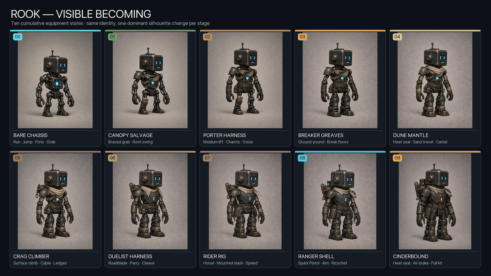

# Rook character-state design pack

This pack visualizes the complete cumulative progression from the stripped **Bare Chassis** to the fully equipped **Cinderbound Final Form**.

## Locked identity

- Same compact square head, cyan eyes, short cyan mouth line, and short antenna
- Same low, sturdy utility-machine proportions
- Same dark iron, aged bronze, pale cloth, cyan signal-light palette
- Equipment accumulates instead of replacing the character
- One dominant silhouette change per state
- Regional handmade materials remain visible inside the final form

## State manifest

| Ordinal | ID | Name | New dominant visual addition | Gameplay unlock | Concept |
|---:|---|---|---|---|---|
| 0 | `bare` | Bare Chassis | Exposed core cage, cables, piston limbs | Run, jump, fists, light grab | [PNG](00-bare-chassis.png) |
| 1 | `canopy` | Canopy Salvage | Asymmetrical shoulder and diagonal vine wrap | Braced grab, root swing | [PNG](01-canopy-salvage.png) |
| 2 | `porter` | Porter Harness | Waist harness, satchel, work forearms, voice grille | Medium lift, charms, voice | [PNG](02-porter-harness.png) |
| 3 | `breaker` | Breaker Greaves | Heavy piston shins and heel blocks | Ground-pound, break floors | [PNG](03-breaker-greaves.png) |
| 4 | `dune` | Dune Mantle | Pale scarf, sand seals, filter, broad soles | Heat travel, sand travel, camel | [PNG](04-dune-mantle.png) |
| 5 | `crag` | Crag Climber | Cable spool, retractable claws and toe spikes | Surface climb, cable traversal | [PNG](05-crag-climber.png) |
| 6 | `duelist` | Duelist Harness | Fitted chest plate and sheathed Roadblade | Sword, parry, cleave | [PNG](06-duelist-harness.png) |
| 7 | `rider` | Rider Rig | Reinforced hips, thighs, and rear saddle lock | Horse riding, mounted slash | [PNG](07-rider-rig.png) |
| 8 | `ranger` | Ranger Shell | Second shoulder, complete torso, pistol and sight | Spark Pistol, aim, ricochet | [PNG](08-ranger-shell.png) |
| 9 | `cinderbound` | Cinderbound Final Form | Sealed Furnace Harness and compact heat exchanger | Heat seal, air brake, complete kit | [PNG](09-cinderbound-final-form.png) |

## Claude Code integration

These images are concept references only. Do not use their visible silhouette as collision geometry.

Use the IDs above as `ArmorStateId` values. The running game should continue to work with procedural placeholders until animation sheets meet the sprite contract in the technical bible:

- 256 × 256 cells
- foot pivot `(128, 224)`
- strict side view facing right
- runtime horizontal flip for left
- one motion per sheet
- animation key `rook.<armorState>.<motion>`

The first implemented gameplay states remain `bare` and `breaker`. The other definitions can load immediately, but their behavior should remain behind ability gates until their milestone is scheduled.

Claude Code can seed its typed armor content from [armor-states.manifest.json](armor-states.manifest.json).

## Production note

The concept images were generated with OpenAI built-in image generation using the original user reference, the stripped anchor, the prior cumulative state, and the end-game anchor in clearly assigned roles. Exact prompts are recorded in [character-state-generation-prompts.md](character-state-generation-prompts.md).
